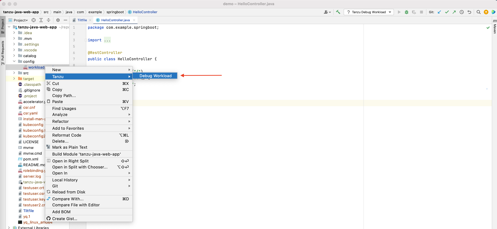
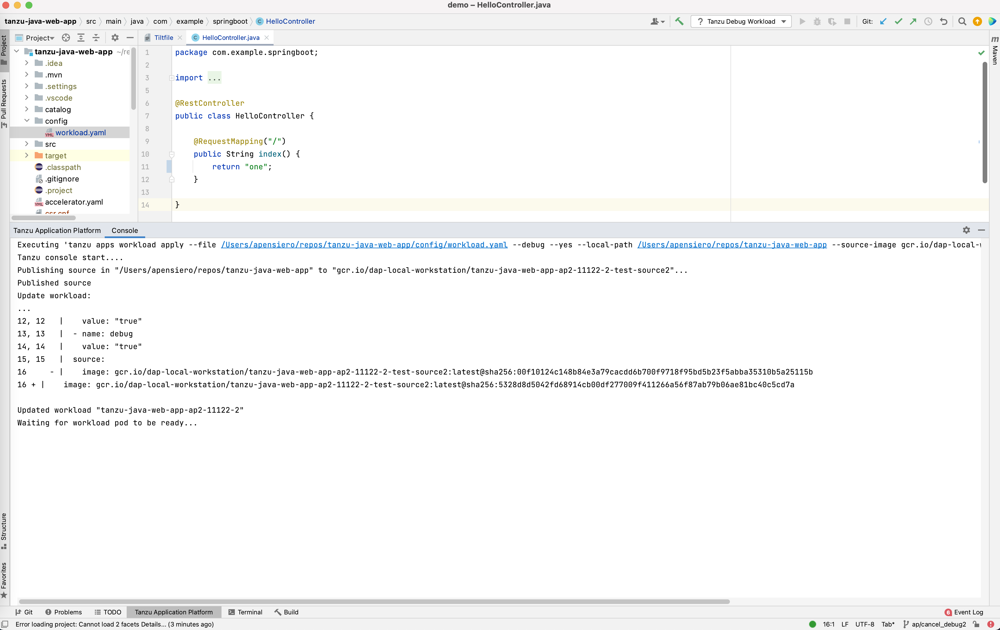
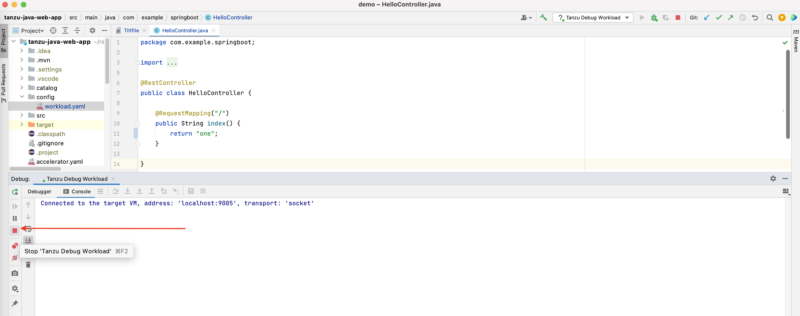

# Using the Tanzu Dev Tools Extension

##  On this page

- [Using the Tanzu Dev Tools Extension](#using-the-tanzu-dev-tools-extension)
  - [ On this page](#-on-this-page)
  - [ Before Beginning](#-before-beginning)
  - [ Debugging on the Cluster](#-debugging-on-the-cluster)
    - [ Start Debugging on the Cluster](#-start-debugging-on-the-cluster)
    - [ Stop Debugging on the Cluster](#-stop-debugging-on-the-cluster)
    - [ Start Live Update](#-start-live-update)
    - [ Stop Live Update](#-stop-live-update)
  - [ Switch Namespace](#-switch-namespace)

##  Before Beginning

Ensure the project you want to use the extension with has the required files specified in the [Getting Started page](../intellij-extension/getting-started.md). Note that the Tanzu Developer Tools extension requires only one Tiltfile and one workload.yaml per project. The workload.yaml must be a single-document YAML file, not a multi-document YAML files.

##  Debugging on the Cluster

The Tanzu Developer Tools extension enables you to debug your application on your TAP-enabled Kubernetes cluster .

Debugging requires a **workload.yaml** file in your project. For information about creating a **workload.yaml** file, see the [Set Up section](../intellij-extension/getting-started.md#set-up-tanzu-dev-tools) on the Getting Started page.

> **Note:** Debugging on the cluster and Live Update can not be used simultaneously. If you have used Live Update for the current project, you must ensure you have stopped live update before attempting to debug on the cluster. See [Stop Live Update](#stop-live-update) below for more information.

###  Start Debugging on the Cluster

To start debugging on the cluster:
1. Add a [breakpoint](https://www.jetbrains.com/help/idea/using-breakpoints.html) in your code.
1. Right-click the **workload.yaml** file in your project.
1. Select `Tanzu -> Debug Workload` in the right-click menu.

1. To view the Debug status you can open the `Tanzu Application Platform` console from the bottom pane of the IntelliJ window.

###  Stop Debugging on the Cluster

To stop debugging on the cluster:
1. Select the stop button in the Debug overlay

###  Start Live Update

- Right-click your project’s `Tiltfile` and select `Tanzu -> Live Update Start`.

###  Stop Live Update

When Live Update stops, your application continues to run on the cluster, but changes you make and save in your editor will not be present in your running application unless you redeploy your application to the cluster.

- Right-click your project’s `Tiltfile` and select `Tanzu: Live Update Stop`. Or use the red square from the run-window to stop the process.

##  Switch Namespace

To switch the namespace that your workload is created in:
1. Navigate to settings (`Preferences -> Build, Execution, Deployment -> Tanzu`)
2. In the Namespace option, add the namespace you want to deploy to. This defaults to the default namespace.